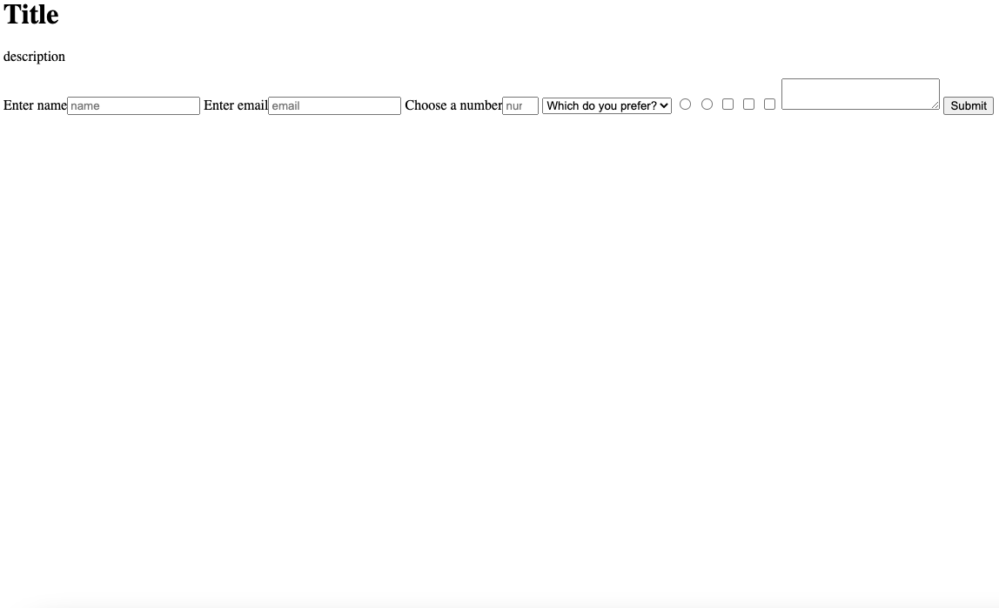

# Projects

* * *

These are some of my projects that I have completed while I have been working on free-code-camp for the last few months.

## City Skyline

    

* <u>About</u>: I created this project on free-code-camp. This was a fun project because it helped me better understand CSS and web designing. 

* Link: [https://github.com/pbon98/City-skyline](https://github.com/pbon98/City-skyline)

## Nutrition Label

    

* <u>About</u>: For this project I created a Nutrition label. I used Html along with CSS to create this.

* Link: [https://github.com/pbon98/Nutrition-Label](https://github.com/pbon98/Nutrition-Label)

## Survey-Form

    

* <u>About</u>: In this project I created a survey form to help collect data from users. 

* Link: [https://github.com/pbon98/Survey-Form](https://github.com/pbon98/Survey-Form)

## Building-a-Penguin

    

* <u>About</u>: In this project I created a penguin using CSS. This really helped me better understand how to use CSS to create something cool. I also learned how to make the penguin wave its arm. Click the link to see more.

* Link: [https://github.com/pbon98/Building-a-penguin](https://github.com/pbon98/Building-a-penguin)

# Building-a-piano

    

* <u>About</u>: In this project I made a piano using CSS. I also learned about media queries and pseudo selectors in this project.

* Link: [https://github.com/pbon98/Building-a-piano](https://github.com/pbon98/Building-a-piano)