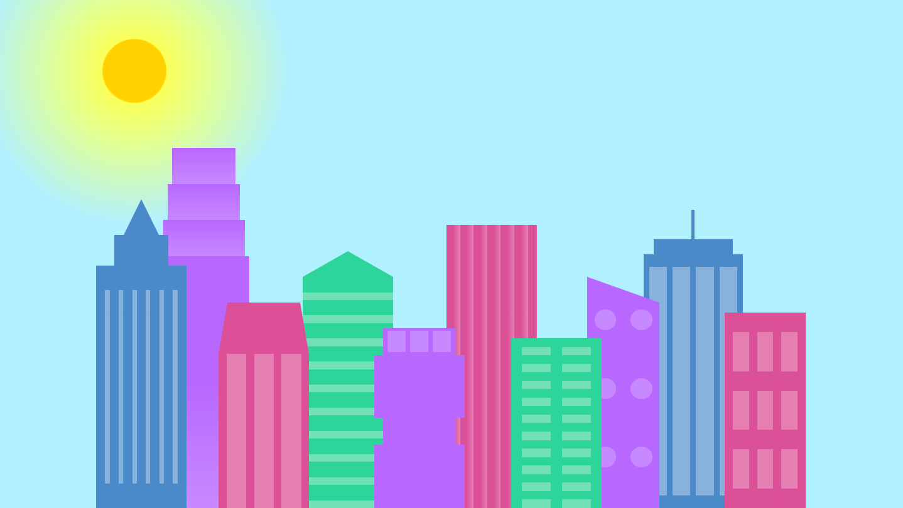
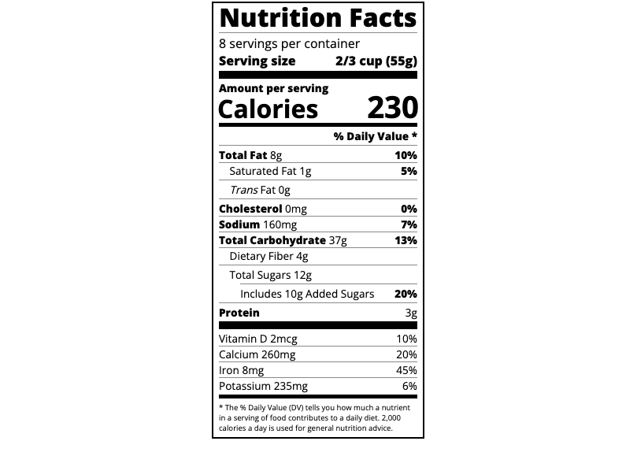
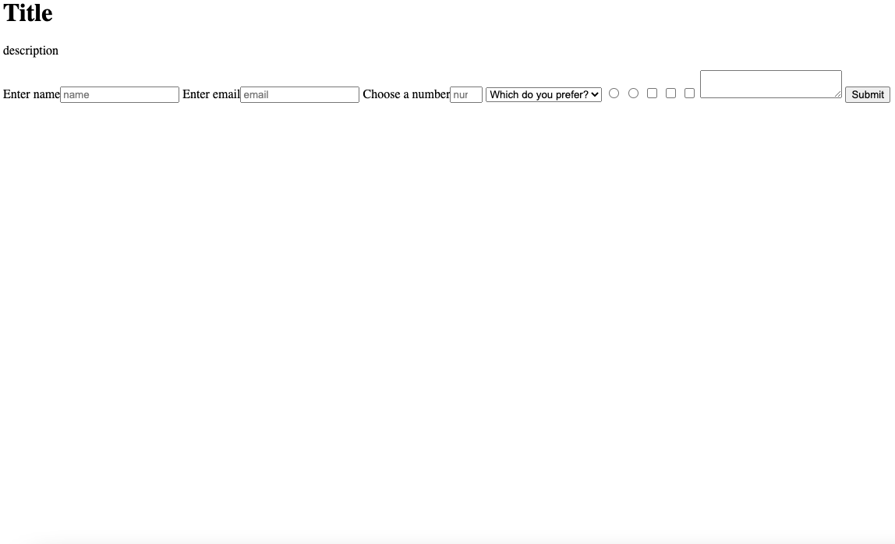

# Projects
<b>[About](./)</b> | <b>Projects</b> | <b>[Resume](./resume.html)</b>
* * *

These are some of my projects that I have completed while I have been working on free-code-camp for the last few months.

## City Skyline

    

* <u>About</u>: I created this project on free-code-camp. This was a fun project because it helped me better understand CSS and web designing. 

## Nutrition Label

    

* <u>About</u>: For this project I created a Nutrition label. I used Html along with CSS to create this.

## Survey-Form

    

* <u>About</u>: In this project I created a survey form to help collect data from users. 

* Link: [file:///Users/parkerbaughan/Repos/Survey-Form/index.html](file:///Users/parkerbaughan/Repos/Survey-Form/index.html)